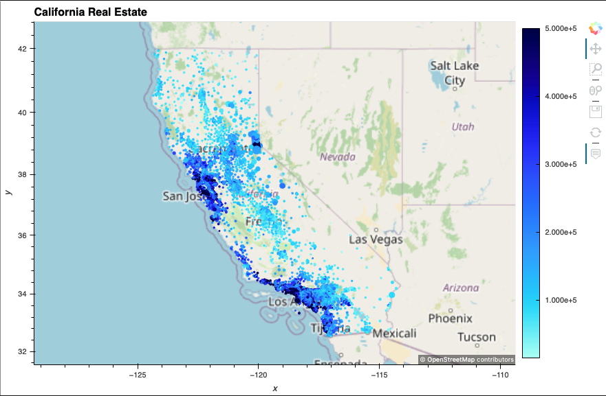
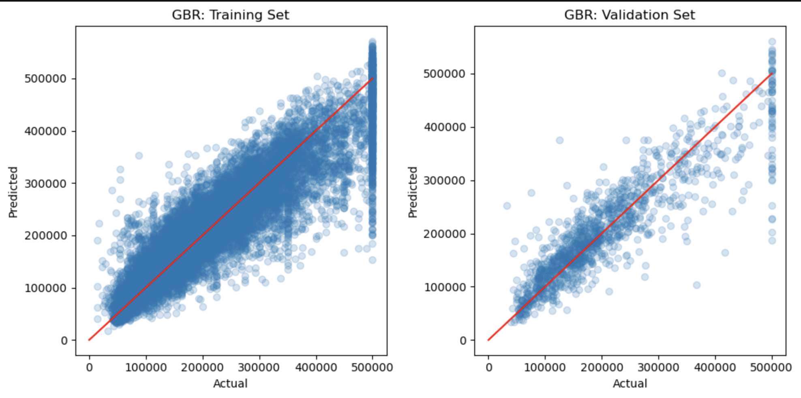
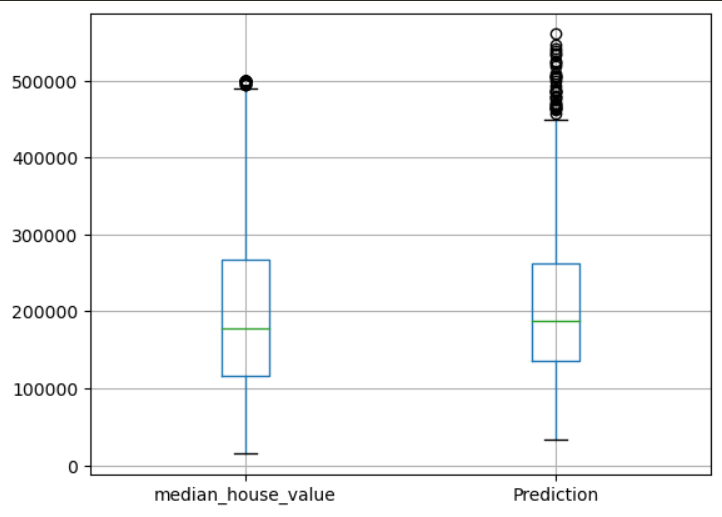
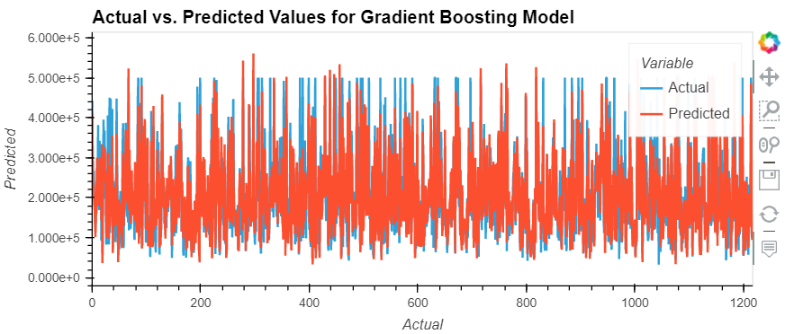
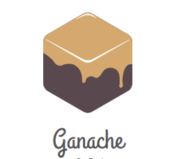
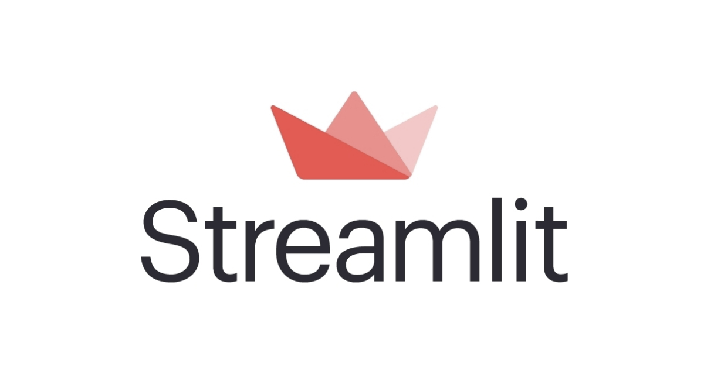
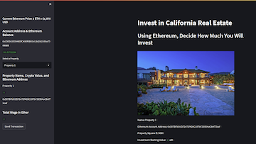
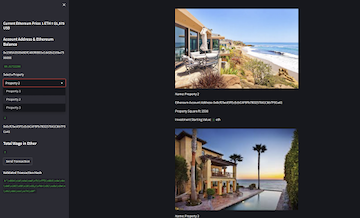

# **Real Estate Prediction with Blockchain Technology**

<p align="center">
  
</p>

<br />

## Description

This project intends to predict future California home prices to give potential investors buying opportunities, using Ethereum. For our dataset, we used Kaggle to obtain data on various metrics regarding California homes. We next used multiple Machine Learning methods in order to evaluate the best model for predicting future home prices.  Lastly, we utilized Blockchain Technology along with Streamlit to create an interactive web application for investors.

<br />
<br />

## Data Analyzed

The California Housing dataset, which is commonly used for machine learning and statistics, derives from the California Census. It was initially published by Pace, R. Kelley and Ronald Barry and is available on the UCI Machine Learning Repository. This dataset contains information about the economic and geographic characteristics of houses, as well as the economic status of residents in California.

<p align="center">
  
</p>

<br />

The California housing dataset provides data on a range of socio-economic characteristics of block groups located in California. Each row in the dataset represents a block group, and there are 20,640 observations, each comprising 10 attributes. The dataset includes the following features:

<br />

- **Housing Median Age:** The median age of the housing units in each block group.
- **Households:** The total number of households in the block group.
- **Latitude:** The latitude of the center of each block group in California.
- **Longitude:** The longitude of the center of each block group in California.
- **Median House Value:** The median value of the housing units in the block group.
- **Median Income:** The median income of the block group.
- **Ocean Proximity:** The proximity of the block group to the ocean or other bodies of water.
- **Population:** The total population of the block group.
- **Total Bedrooms:** The total number of bedrooms in the housing units in each block group.
- **Total Rooms:** The total number of rooms in the housing units in each block group.


<br />
<br />


## **Machine Learning Models**

* ***Linear Regression*** - Machine learning algorithm used for predicting continuous target variables based on one or more independent variables. It works by finding a linear relationship between the independent variables (also known as features) and the target variable. 

* ***K Nearest Neighbors*** - Machine learning algorithm, that works by finding the K nearest data points in the training set to a new data point, and then making a prediction based on the most common class or the average value of the K nearest neighbors. The value of K is a hyperparameter that needs to be tuned based on the data and the problem at hand.

* ***Random Forest*** - Random Forest is a machine learning algorithm, where each decision tree is trained on a random subset of the features and a random subset of the training data. This creates a diverse set of models that are less likely to make the same mistakes. The final prediction is then made by averaging the predictions of all the individual trees.

* ***Gradient Boosting Regressor*** - Gradient Boosting Regressor works by iteratively adding new decision trees to the model, with each tree attempting to correct the errors of the previous tree. The final prediction is then made by summing the predictions of all the individual trees.


* ***Neural Networks*** - Neural Networks are a type of machine learning algorithm that is inspired by the structure and function of the human brain. They are composed of multiple interconnected nodes, called neurons, that work together to perform complex computations on input data and produce output predictions.

<br />
<br />

## Machine Learning Results


**Linear Regression** <br>
  (Mean Squared Error): 68593.05578127236<br>
  (Mean Squared Error): 71382.43558330163<br>
  (Mean Absolute Error): 49754.40656859453<br>
  (Mean Absolute Error): 51368.037095801905<br>
  (Root Mean Squared Error): 261.90276016352396<br>
  (Root Mean Squared Error): 267.17491570748484<br>
  <br>
**K-Nearest Neighbors**<br>
  (Mean Squared Error): 53759.09908812057<br>
  (Mean Squared Error): 62161.22860469906<br>
  (Mean Absolute Error): 36167.44879444445<br>
  (Mean Absolute Error): 40880.82077175698<br>
  (Root Mean Squared Error): 231.8600851550792<br>
  (Root Mean Squared Error): 249.32153658418494<br>
  <br>
**Random Forest**<br>
  (Mean Squared Error): 53759.09908812057<br>
  (Mean Squared Error): 62161.22860469906<br>
  (Mean Absolute Error): 36167.44879444445<br>
  (Mean Absolute Error): 40880.82077175698<br>
  (Root Mean Squared Error): 208.56612659255168<br>
  (Root Mean Squared Error): 231.43986790453792<br>
  <br>
**Neural Network** <br>
 (Mean Squared Error): 220478.83820774715<br>
 (Mean Squared Error): 220708.7079338669<br>
 (Mean Absolute Error): 189552.3961626945<br>
 (Mean Absolute Error): 189486.02469791606<br>
 (Root Mean Squared Error): 469.551741779058<br>
 (Root Mean Squared Error): 469.7964537263632<br>
 <br>
 **<p align="center">
 Gradient Boosting (Winner)**
 <br>
  (Mean Squared Error): 53759.09908812057<br>
  (Mean Squared Error): 62161.22860469906<br>
  (Mean Absolute Error): 36167.44879444445<br>
  (Mean Absolute Error): 40880.82077175698<br>
  (Root Mean Squared Error): 217.42774107901127<br>
  (Root Mean Squared Error): 226.5915817172601<br>
  </p>
<br>
<br>


 <p align="center">
  
</p>

<br>
<br>

 <p align="center">
  
</p>

<br>
<br>

<p align="center">
  
</p>

<br>
<br>

## **Blockchain Requirements**

- **Crypto Wallet:** Investors must own a digital wallet that holds funds in the form of Ethereum cryptocurrency. A crypto wallet is a software application that stores public and private keys used for sending, receiving, and storing digital assets like cryptocurrencies.

<br />

<p align="center">
  
</p>

<br />

- **Ganache:** Ganahce is the source of Cryptocurrency Funds, and is used to create a local blockchain network that mimics the main Ethereum network. This allows for testing and experimenting with applications in a secure environment without spending real cryptocurrency.

<br />
<p align="center">
  
</p>


<br />

- **Streamlit:** Streamlit is a Web Application that allows users to create interactive data visualizations, web applications, and machine learning models. We used Streamlit to create a user-friendly interface for potential investors to view the properties and execute transactions using Ethereum cryptocurrency.

<br />

<p align="center">
  
</p>

<br />

## Blockchain Results
We were able to successfully run our streamlit application for three individual properties. Our streamlit application includeded multiple different components:  

- The current price of Ethereum in USD.
- Input box for the sender's account address with their current Ethereum balance.
- A dropdown menu to choose between the three properties.
- Cryptocurrency Value of the Individual Properties.
- The total wage in Ethereum for the transaction with a button to send the transaction.
- A validated transaction hash.

<p align="center">
  
</p>

<br />
<p align="center">
  
</p>
<br />
<br />

## Challenges

- For the machine learning section, we were unable to achieve a high accuracy score amongst all of our models. This proved difficult as we were hoping that our findings would have more external validity.
- Due to other limits, we were unable to merge our machine learning code with our blockchain application. This meant that we needed to manually update to the blockchain application for the real estate evaluations.
- We were not able to include live refreshes for changes in the price of Ethereum.


## Conclusion

Overall it was a very fun project with many things to take away. We as a team learned that predicting real estate prices can be a very tough task with datasets being very limited. Our blockchain contract worked out very well and we feel it was a great additon to real estate machine learning. We developed a great understanding of the Real Estate Market for California and could easily do the same for any area of the globe!


## Future Expanse

Tokenization of Real Estate is something that has became very popular and it would be a great next step into our ventures. Adding data mining for better and more accurate data sets would help tremendously on all aspects. Other forms of lead generation such as homes in default or approaching tax sale would be a great advantage of offering tremendous opportunities for investors. 

<br />
<br />

## Installation Guide

```
pip install streamlit
pip install python-dotenv
pip install datetime
pip install pandas
pip install typing
pip install dataclasses
pip install bip44
pip install mnemonic
pip install eth-tester
pip install web3
pip show protobuf
pip install --upgrade protobuf
pip install -U scikit-learn
pip install tensorflow==2.11
pip install seaborn
pip install hvplot
conda install -c pyviz hvplot geoviews
```


## Made Using:
* [Blockchain](https://www.blockchain.com/) - Digital Ledger
* [Conda](https://docs.conda.io/en/latest/) - Package Manager
* [Ethereum](https://ethereum.org/en/) - Cryptocurrency
* [Hvplot](https://hvplot.holoviz.org/) - Data Visualization in Pandas
* [Kaggle](https://www.kaggle.com/) - Real Estate Data
* [Matplotlib](https://hvplot.holoviz.org/) - Data Visualization
* [Numpy](https://numpy.org/) - Array Library
* [Pandas](https://pandas.pydata.org/) - Data Analysis
* [Pathlib](https://plotly.com/python/) - Python module for paths
* [Prophet](https://facebook.github.io/prophet/) - Forecasting Machine Learning Library
* [Python](https://docs.python.org/3/library/) - Programming Language
* [Scikit-Learn](https://scikit-learn.org/stable/) - Machine Learning
* [Seaborn](https://seaborn.pydata.org/)  - Visualization library
* [Streamlit](https://streamlit.io/) - Building Data Application
* [Tensor-Flow](https://www.tensorflow.org/) - Deep Learning

## Project Contributors

* **Gabriel Millan** : [LinkedIn](https://www.linkedin.com/in/millangabriel/) | [Github](https://github.com/gjmillan)

* **Tim Clemens** : [Github](https://github.com/AmericanHacker)

* **Brandon Latherow** : [LinkedIn](https://www.linkedin.com/in/brandon-latherow-4703a9214/) | [Github](https://github.com/brandonlatherow)
